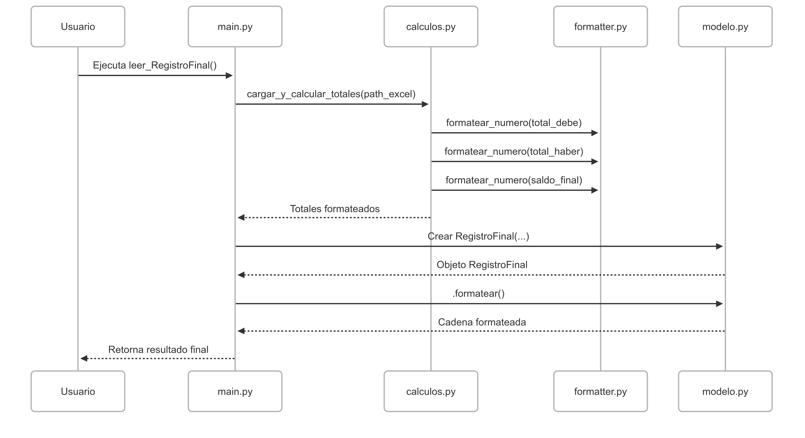

# Conversor de Excel a Norma 43

Este proyecto permite convertir un archivo **Excel con movimientos bancarios** a un archivo en formato **Norma 43**, utilizado por entidades bancarias españolas.  

La conversión sigue un flujo estructurado que puedes consultar en el **diagrama de secuencia adjunto**.

> Este conversor está diseñado inicialmente para un formato de Excel específico.  
> Puede adaptarse a cualquier otro archivo Excel **ajustando ligeramente el código según las necesidades del nuevo formato**.

Este es un proyecto **inicial**, funcional como base, y con potencial para **mejoras** y ampliaciones según nuevas necesidades o estructuras de datos.

---

## Diagrama de Secuencia del Proceso



> Esta imagen representa **una parte del flujo de conversión**, mostrando cómo se relacionan los distintos módulos del script durante el procesamiento del archivo. Es útil como guía técnica para entender el comportamiento interno del sistema.

---

## Flujo del Proceso

1. **Lectura del archivo Excel**  
   Se cargan los datos desde el archivo original (fechas, importes, conceptos, etc.).

2. **Procesamiento y validación de datos**  
   Se revisan y transforman los datos según la estructura requerida por la Norma 43.

3. **Generación del archivo Norma 43**  
   Se arma el archivo en formato texto plano siguiendo las especificaciones bancarias.

4. **Exportación**  
   El archivo se guarda localmente, listo para ser enviado a la entidad correspondiente.

---

## Módulos incluidos

- `lector_excel.py`  
  Lee y estructura los datos del Excel de entrada.

- `formateador_norma43.py`  
  Formatea los datos conforme a la norma bancaria.

- `generador_archivo.py`  
  Genera y guarda el archivo `.txt` final.

- `app.py`  
  Coordina la ejecución completa del proceso.

---


---

## Instalación de Dependencias

Este proyecto requiere **Python 3.11 o superior**. Instala los paquetes necesarios ejecutando:

```bash
pip install -r requirements.txt


